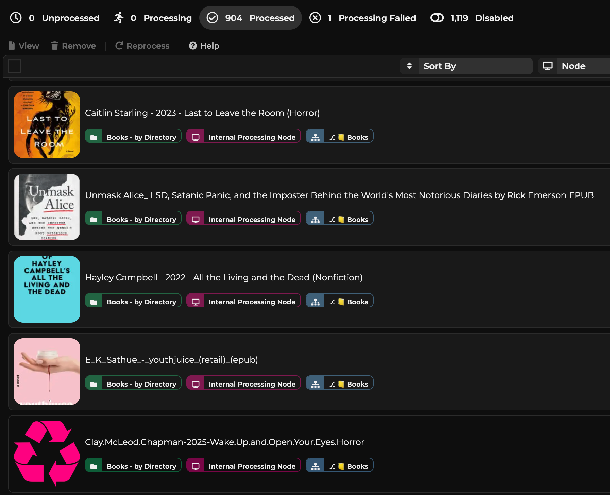

FileFlows Audiobookshelf Prep Flows
===================================

## Meet the flows
Flows that prep book folders/files (ebooks and audiobooks) for Audiobookshelf: clean up, enrich metadata, convert ebooks to EPUB, and place audio/ebook assets into your library structure.
- Entry flows: `📒 Books.json` (folder-triggered) and `📒 Books by File.json` (file-triggered).
- Subflows: `Subflow prep book workspace`, `Subflow set book from folder`, `Subflow fetch Google book info`, `Subflow find book series from Google info`, `Subflow set book from search`, `Subflow query OpenAI for book info`.

## Why use this
- Automates metadata lookup (Google Books, Open Library, optional OpenAI) and EPUB conversion.
- Normalizes author/series/book folders for Audiobookshelf.
- Handles both folder and single-file drop scenarios.

## Prerequisites
- Plugins Book and Web installed/enabled (Settings > Extensions > Plugins); provides nodes like `FileFlows.Book.EBookConverter` and Web Request.
- Variables (Settings > Extensions > Variables):
  - `audiobookshelfApiToken`
  - `audiobookshelfApiUrl` (e.g., `https://bookshelf.my.app/audiobookshelf/api/`)
  - `AudiobookshelfLibraryPath` (e.g., `/media/youruser/library/Books/Books/` with trailing slash)
- OpenAI (optional): get a key at https://platform.openai.com/api-keys and set `openAISecretKey` (leave blank to skip OpenAI; flow still runs). Example key format: `eyJh....w8j-tM`.
- Resources: upload `resources/Recycle.png` as `Recycle` and `resources/trash.png` as `Trash` via Settings > System > Resources > Add +.

## Creating/importing the flows
Import in this order to satisfy subflow dependencies:
1) `Subflow query OpenAI for book info`
2) `Subflow fetch Google book info`
3) `Subflow set book from search` (depends on the OpenAI subflow)
4) `Subflow set book from folder`
5) `Subflow prep book workspace`
6) `Subflow find book series from Google info`
7) `📒 Books by File.json`
8) `📒 Books.json`

## Configure after import
- Library paths:
  - `📒 Books.json` → node `Move eBook Directory`: set `DestinationPath` to your Audiobookshelf books path.
  - `📒 Books by File.json` → node `Set: authorDirectory`: update the base path for authors.
  - Both flows use `finalDestinationDirectory` variables; ensure they match your layout.
- Optional: confirm `AudiobookshelfLibraryPath` matches your environment.

## How it runs
- Folder-triggered (`📒 Books.json`):
  - Prep workspace and detect unwanted archives.
  - Derive book metadata from folder name; validate mp3 layout; convert ebooks to EPUB.
  - Fetch metadata from Google Books; enrich series info from Open Library; build author/series folders.
  - Copy/rename into the Audiobookshelf structure and clean up the source.
- File-triggered (`📒 Books by File.json`):
  - Set search title from the file name; fetch metadata via Google Books/OpenAI.
  - Create author/series folders, convert to EPUB, move/rename into place.

## Usage
- Point a FileFlows file/folder watcher at your incoming source and assign the appropriate entry flow (folder vs file).
- If import errors mention missing subflows, import dependencies first, then the parent.
- Detecting books from folder structures is tricky because sources are inconsistent; if you improve detection/enrichment, PRs are welcome.
