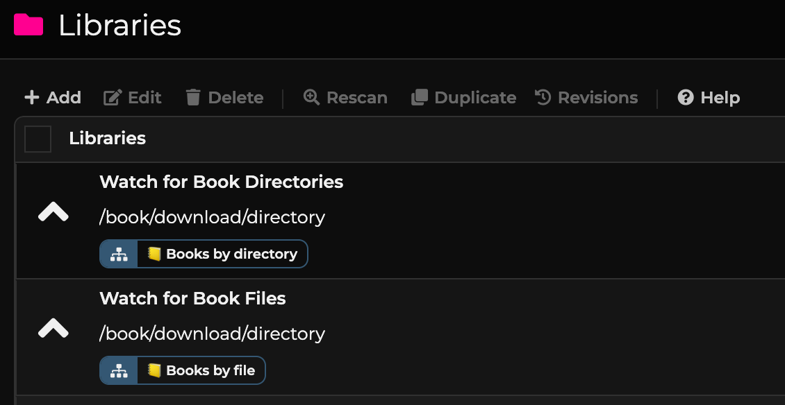
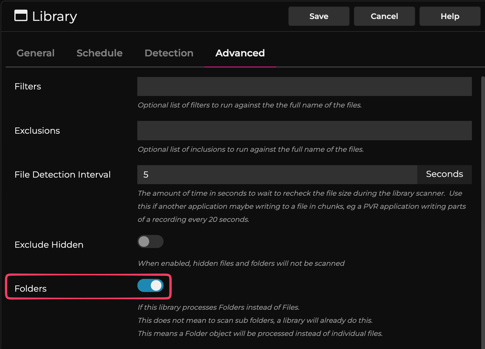

FileFlows Audiobookshelf Prep Flows
===================================

## Why use this
- Automates metadata lookup (Google Books, Open Library, optional OpenAI) and EPUB conversion.
- Normalizes author/series/book folders for Audiobookshelf.
- Handles both folder and single-file drop scenarios.

## Meet the flows
Flows that prep book folders/files (ebooks and audiobooks) for Audiobookshelf: clean up, enrich metadata, convert ebooks to EPUB, and place audio/ebook assets into your library structure.

### High-level summary
1. Intake + workspace prep: if the drop is a single folder inside another, pull the inner folder out and rerun it ; if it's only zip/rar junk, log it, mark it for deletion , and stop.
2. Derive title/author hints from folder/file names, then fetch/enrich metadata (Google Books, Open Library, optional OpenAI).
3. Build author/series folders and convert ebooks to EPUB where needed.
4. Move/rename into the Audiobookshelf layout and tidy the workspace.

### Entry flows
- `📒 Books by directory.json` (folder-triggered): takes a folder drop, prepares the workspace, enriches metadata, and shelves it in your Audiobookshelf layout.
- `📒 Books by file.json` (file-triggered): takes a single book file, fetches/enriches metadata, converts to EPUB if needed, and shelves it in your Audiobookshelf layout.

#### Subflows
`Subflow prep book workspace`, `Subflow set book from folder`, `Subflow fetch Google book info`, `Subflow find book series from Google info`, `Subflow set book from search`, `Subflow query OpenAI for book info`.

## Prerequisites
- Plugins Book and Web installed/enabled (Settings > Extensions > Plugins); provides nodes like `FileFlows.Book.EBookConverter` and Web Request.
- Variables (Settings > Extensions > Variables):
  - `audiobookshelfApiToken`
  - `audiobookshelfApiUrl` (e.g., `https://bookshelf.my.app/audiobookshelf/api/`)
  - `AudiobookshelfLibraryPath` (e.g., `/media/youruser/library/Books/Books/` with trailing slash)
- OpenAI (optional): get a key at https://platform.openai.com/api-keys and set `openAISecretKey` (leave blank to skip OpenAI; flow still runs). Example key format: `eyJh....w8j-tM`.
- Resources: upload `resources/Recycle.png` as `Recycle` and `resources/trash.png` as `Trash` via Settings > System > Resources > Add +.

## How to use

### 1. Import the FileFlow flows
Import in this order to satisfy subflow dependencies:
1) `Subflow query OpenAI for book info`
2) `Subflow fetch Google book info`
3) `Subflow set book from search` (depends on the OpenAI subflow)
4) `Subflow set book from folder`
5) `Subflow prep book workspace`
6) `Subflow find book series from Google info`
7) `📒 Books by file.json`
8) `📒 Books by directory.json`

### Configure FileFlow libraries

1. Library: Watch for Book Directories
   - Flow: `📒 Books by directory.json`
   - Path: The download directory you drop unprocessed books into (typically from NZB or Torrent)
   - Advanced Tab > Folders: `true`
     
2. Library: Watch for Book Files
   - Flow: `📒 Books by file.json`
   - Path: The download directory you drop unprocessed books into (typically from NZB or Torrent)
   - Extensions: `m4b`, `wav`, `mobi`, `mp3`, `epub`, `flac`, `pdf`, `wma`, `cbr`, `m4a`, `cbz`, `aac`, `azw3`
     
